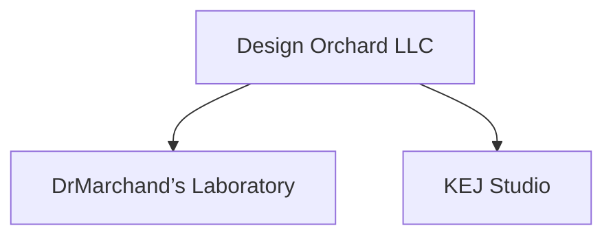

# Design Orchard LLC - Public Architecture

> A release-safe map of the company and its operating lanes. Private infrastructure and implementation detail live elsewhere.

## Legal root

**Design Orchard LLC** is the legal and operating company.

Its two primary operating lanes are siblings:



Communication between the lanes does not merge their identities or transfer authority.

## Laboratory systems

DrMarchand’s Laboratory may use several distinct systems:

| System | Function |
| --- | --- |
| DrMarchand’s ⚙︎ Nɛuro-Forge Engine™ | Bounded execution and orchestration |
| DrMarchand’s OS™ | Presentation, navigation, routing, and lifecycle state |
| 🗺️ DrMarchand’s ⚛︎ Atlas | Registered mapping and truth-resolution context |
| 📚 DrMarchand’s ⚛︎ Library™ | Preservation, indexing, curation, and recall |

These systems can connect without becoming the same thing. The OS is not the Engine. Atlas resolves registered relationships and state. The Library preserves durable records rather than temporary working state.

## Creative lane

**KEJ Studio** produces design, branding, media, and other creative work. **DrMarchand’s 🎨 Creative Canvas** is a working creative surface and may participate in an explicit handoff between creative and technical work.

## Public / private boundary

```text
private working state
-> validation
-> redaction
-> release-safe artifact
-> public repository / website
```

Public GitHub should not expose credentials, private device identity, Vault topology, private storage locators, local production markers, or unnecessary internal routing detail.

## Source-of-truth boundary

Public GitHub is versioned engineering and documentation evidence. Private registries, runtime receipts, custody records, and authorized-human decisions determine the broader state they actually prove.
