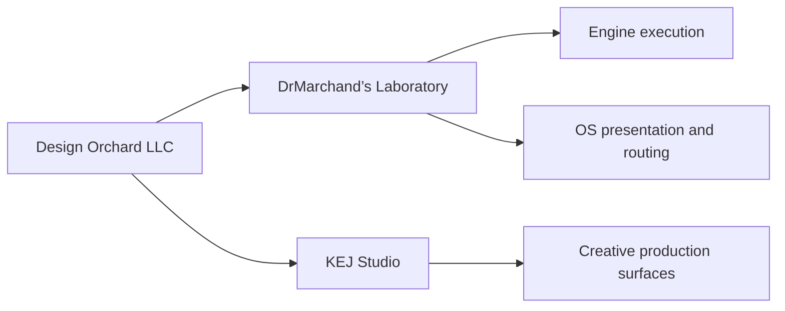

# Design Orchard LLC

> The legal and operating root for a creative-technology ecosystem built around research, software, design, preservation, and deliberate release.

**Public company surface** · **Evidence before claims** · **Private machinery stays private**

## Company map

| Surface | Role |
| --- | --- |
| `Design Orchard LLC` | Legal and operating company |
| `🌴 Design Orchard™` | Public ecosystem brand |
| `🏝️ Design Orchard℠` | Service surface |
| `DrMarchand’s Laboratory` | Research, software, experimentation, and technical operations |
| `KEJ Studio` | Creative production, design, media, and client work |

DrMarchand’s Laboratory and KEJ Studio are sibling operating lanes under Design Orchard LLC. Their tools and records may connect without collapsing into one namespace.

## Operating model



The execution system and the presentation system are deliberately separate: **DrMarchand’s ⚙︎ Nɛuro-Forge Engine™** executes within delegated permission; **DrMarchand’s OS™** presents, navigates, and routes state.

## Public boundary

This repository is the company-level public documentation surface. It should contain company structure, published relationships, and release-safe documentation - not credentials, private device identities, Vault topology, private storage locators, unpublished production markers, or working secrets.

Internal operating doctrine belongs in private repositories or controlled storage. Public history may preserve older material as provenance, but current documentation must not present superseded internal detail as live architecture.

## Repository guide

- [`ARCHITECTURE.md`](ARCHITECTURE.md) - current public ecosystem relationships.
- [`BUSINESS-STRUCTURE.md`](BUSINESS-STRUCTURE.md) - legal root and sibling operating lanes.
- [`NOTICE`](NOTICE) - attribution and repository notices.
- [`LICENSE`](LICENSE) - repository license terms.

## Release rule

```text
WORK -> TEST -> VALIDATE -> REDACT -> PUBLISH
```

A file, schema, commit, screenshot, or checksum proves only what it directly demonstrates. Public visibility does not by itself establish deployment, completion, ownership, licensing, or commercial availability.

## Authority

**Legal and operating company:** Design Orchard LLC

Work-specific authorship, copyright, licensing, and publication records control the rights attached to individual artifacts. Brand marks and machine identifiers remain separate from the legal entity name.

---

**Design; From the Ground, Up.**
